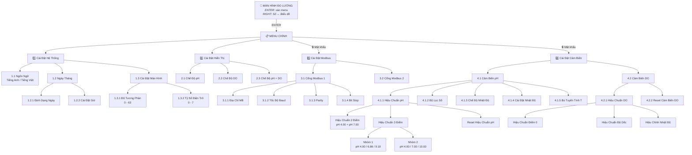

# 📘 Hướng Dẫn Sử Dụng Thiết Bị Giám Sát Chất Lượng Nước MebiEco

**Mã sản phẩm:** ESP32-S3 pH/DO/Temperature Monitoring System  
**Phiên bản tài liệu:** 1.0  
**Ngày cập nhật:** 15/07/2026

---

## 📑 Mục Lục

1. [Giới thiệu tổng quan](#1-giới-thiệu-tổng-quan)
2. [Bố cục nút bấm và chức năng](#2-bố-cục-nút-bấm-và-chức-năng)
3. [Màn hình khởi động](#3-màn-hình-khởi-động)
4. [Màn hình đo lường chính](#4-màn-hình-đo-lường-chính)
5. [Hệ thống menu cài đặt](#5-hệ-thống-menu-cài-đặt)
6. [Cài đặt hệ thống (System Settings)](#6-cài-đặt-hệ-thống)
7. [Cài đặt hiển thị (Display Settings)](#7-cài-đặt-hiển-thị)
8. [Cài đặt Modbus (Modbus Settings)](#8-cài-đặt-modbus)
9. [Cài đặt cảm biến (Sensor Settings)](#9-cài-đặt-cảm-biến)
10. [Hiệu chuẩn pH](#10-hiệu-chuẩn-ph)
11. [Hiệu chuẩn DO](#11-hiệu-chuẩn-do)
12. [Web Portal (Cổng cấu hình WiFi)](#12-web-portal)
13. [Khởi động lại thiết bị](#13-khởi-động-lại-thiết-bị)
14. [Sơ đồ cây menu đầy đủ](#14-sơ-đồ-cây-menu-đầy-đủ)
15. [Bảng tra cứu nhanh nút bấm](#15-bảng-tra-cứu-nhanh-nút-bấm)

---

## 1. Giới Thiệu Tổng Quan

Thiết bị **MebiEco** là hệ thống giám sát chất lượng nước công nghiệp, đo lường 3 thông số chính:

| Thông số | Phạm vi đo | Đơn vị | Giao diện cảm biến |
|:---|:---|:---|:---|
| **pH** | 0.00 – 14.00 | pH | Đầu dò điện cực thủy tinh qua ADC CS1237 24-bit |
| **DO (Oxy hòa tan)** | 0.00 – 20.00 | mg/L | Cảm biến quang học Modbus RS485 (KOG206) |
| **Nhiệt độ** | -20.0 – 150.0 | °C / °F | Cảm biến PT1000 / NTC |

**Màn hình:** LCD đồ họa đơn sắc **128×64 pixel** (GMG12864-06D), hiển thị rõ nét dưới ánh sáng mạnh.

---

## 2. Bố Cục Nút Bấm Và Chức Năng

Thiết bị có **5 nút bấm vật lý** nằm trên mặt trước:

```
 ┌───────────────────────────────────────────────────────┐
 │                                                       │
 │               [ MÀN HÌNH LCD 128×64 ]                 │
 │                                                       │
 ├───────────────────────────────────────────────────────┤
 │                                                       │
 │   [ESC]   [DOWN ▼]   [UP ▲]   [RIGHT ►]   [ENTER ✓]   │
 │                                                       │
 └───────────────────────────────────────────────────────┘
```

### Bảng chức năng từng nút

| Nút | Ký hiệu trên LCD | Chức năng ở Màn hình đo | Chức năng trong Menu |
|:---|:---:|:---|:---|
| **ESC** | `ESC` | *(không dùng)* | Quay lại trang trước / Thoát menu |
| **DOWN ▼** | `▼` | *(không dùng)* | Di chuyển con trỏ xuống / Giảm giá trị |
| **UP ▲** | `▲` | *(không dùng)* | Di chuyển con trỏ lên / Tăng giá trị |
| **RIGHT ►** | `►` | Chuyển đổi giữa hiển thị **Số** ↔ **Biểu đồ** | Chuyển ô nhập liệu (trong cài đặt giờ / mật khẩu) |
| **ENTER ✓** | `ENT` | Vào hệ thống Menu chính | Xác nhận lựa chọn / Lưu cài đặt |

> [!IMPORTANT]
> **Nhấn giữ nút ENTER trong 7 giây** ở bất kỳ màn hình nào sẽ **khởi động lại toàn bộ thiết bị**. Xem mục [13. Khởi động lại thiết bị](#13-khởi-động-lại-thiết-bị).

---

## 3. Màn Hình Khởi Động

Khi **bật nguồn**, thiết bị sẽ hiển thị **logo MebiEco** tràn viền trên toàn bộ màn hình LCD trong **5 giây**, sau đó tự động chuyển sang màn hình đo lường chính.

```
┌──────────────────────────────┐
│                              │
│                              │
│        [LOGO MEBICO]         │
│        128×64 bitmap         │
│                              │
│                              │
└──────────────────────────────┘
        ← Hiển thị 5 giây →
```

> [!NOTE]
> Trong lúc hiển thị logo, hệ thống đang tải cấu hình đã lưu (ngôn ngữ, chế độ hiển thị, hiệu chuẩn, Modbus…) từ bộ nhớ NVS.

---

## 4. Màn Hình Đo Lường Chính

Sau khi khởi động xong, thiết bị hiển thị **màn hình đo lường** với dữ liệu cảm biến thời gian thực. Có **3 chế độ hiển thị** và **2 kiểu hiển thị**.

### 4.1 Kiểu hiển thị Số (Mặc định)

> **Chuyển đổi:** Bấm nút **RIGHT ►** trên màn hình đo lường để chuyển giữa kiểu Số ↔ Biểu đồ.

#### Chế độ pH (hiển thị pH toàn màn hình)

```
┌──────────────────────────────┐
│▌MebiEco            RS485    ▐│  ← Thanh trên (nền đen, chữ trắng)
│▌                            ▐│
│▌          7.02 pH           ▐│  ← Giá trị pH lớn (font chữ đại 3x3)
│▌                            ▐│
│▌Dien Cuc pH       25.3°C    ▐│  ← Nhãn + Nhiệt độ (nền đen, chữ trắng)
│▌22-05-2026      09:30 AM    ▐│  ← Ngày + Giờ
└──────────────────────────────┘
```

#### Chế độ DO (hiển thị DO toàn màn hình)

```
┌──────────────────────────────┐
│▌MebiEco            RS485    ▐│
│▌                            ▐│
│▌        8.21 mg/L           ▐│  ← Giá trị DO lớn (font chữ đại)
│▌                            ▐│
│▌Oxy: 98.2%         25.3°C   ▐│  ← Độ bão hòa + Nhiệt độ
│▌22-05-2026      09:30 AM    ▐│
└──────────────────────────────┘
```

#### Chế độ Song Song (DUAL - hiển thị cả pH và DO)

```
┌──────────────────────────────┐
│▌MebiEco            RS485    ▐│
│▌                            ▐│
│▌   7.02    │    8.21        ▐│  ← pH (trái) | DO (phải) font vừa (2x2)
│▌    pH     │   mg/L         ▐│  ← Đơn vị
│▌                            ▐│
│▌Oxy: 98.2%         25.3°C   ▐│
│▌22-05-2026      09:30 AM    ▐│
└──────────────────────────────┘
```

### 4.2 Kiểu hiển thị Biểu Đồ

Khi bấm nút **RIGHT ►** ở màn hình đo lường, thiết bị chuyển sang **chế độ biểu đồ thời gian thực**:

```
┌──────────────────────────────┐
│▌pH 7.02           25.3°C    ▐│  ← Giá trị hiện tại + Nhiệt độ (nền đen)
│▌                            ▐│
│▌ 14 ┬─────────────────●     ▐│  ← Trục Y: giá trị pH/DO
│▌    │     ╱╲     ╱╲ ╱       ▐│
│▌  7 ┤────╱──╲───╱──●        ▐│  ← Biểu đồ cuộn trái-phải
│▌    │   ╱    ╲ ╱            ▐│
│▌  0 ┴─────────────────────  ▐│  ← Trục X: thời gian (~48 giây)
└──────────────────────────────┘
```

- Mỗi điểm dữ liệu cách nhau **2 giây**.
- Cửa sổ hiển thị **24 điểm** ≈ **48 giây** dữ liệu liên tục.
- Biểu đồ cuộn tự động từ trái sang phải.
- Bấm **RIGHT ►** lần nữa để quay lại kiểu Số.

### 4.3 Bảng tóm tắt thao tác trên màn hình đo

| Thao tác | Nút bấm | Kết quả |
|:---|:---:|:---|
| Vào menu cài đặt | **ENTER** | Chuyển sang Menu Chính |
| Chuyển Số ↔ Biểu đồ | **RIGHT ►** | Đổi kiểu hiển thị (lưu tự động) |
| Khởi động lại thiết bị | **Giữ ENTER 7 giây** | Reset hệ thống |

---

## 5. Hệ Thống Menu Cài Đặt

### 5.1 Cách vào Menu

Từ **màn hình đo lường**, bấm nút **ENTER** → Thiết bị chuyển sang **Menu Chính**.

### 5.2 Bố cục màn hình Menu

Mỗi trang menu có bố cục cố định:

```
┌──────────────────────────────┐
│▌ Menu Chinh                 ▐│  ← Thanh tiêu đề (y=0-11, nền đen chữ trắng)
│                              │
│  1 Cai Dat He Thong          │  ← Danh sách mục (4 mục hiển thị cùng lúc)
│ ▶2 Cai Dat Hien Thi    ▶     │  ← Mục đang chọn (nền đen chữ trắng, có ►)
│  3 Cai Dat Modbus            │
│  4 Cai Dat Cam Bien          │
│                              │
│▌ESC  ▼  ▲  ►  ENT           ▐│  ← Thanh trạng thái (nền đen, hiện nút bấm)
└──────────────────────────────┘
```

### 5.3 Nguyên tắc điều hướng chung

| Nút | Chức năng |
|:---|:---|
| **UP ▲** | Di chuyển lên mục trước |
| **DOWN ▼** | Di chuyển xuống mục tiếp theo |
| **ENTER** | Vào mục con hoặc xác nhận lựa chọn |
| **ESC** | Quay lại trang trước (trang cha) |
| **RIGHT ►** | Chuyển trường nhập liệu (chỉ trong cài đặt giờ / mật khẩu) |

> [!TIP]
> - Mục **đang được chọn** hiển thị **nền đen chữ trắng** và có mũi tên **►** bên phải (nếu có trang con).
> - Nếu tên mục dài quá kích thước màn hình, **chữ sẽ tự động cuộn ngang** để hiện đầy đủ.
> - Khi danh sách có **nhiều hơn 4 mục**, mũi tên **▲/▼ nhỏ** sẽ xuất hiện ở góc phải để báo hiệu còn mục ẩn phía trên/dưới.
> - Mục đang được chọn hiện tại (đã lưu) sẽ có **dấu sao (*)** bên phải.

### 5.4 Quay về màn hình đo lường

Bấm **ESC** liên tục cho đến khi quay về trang **Menu Chính**, sau đó bấm **ESC** thêm 1 lần nữa → Quay về **màn hình đo lường**.

---

## 6. Cài Đặt Hệ Thống

**Đường dẫn:** Menu Chính → **1 Cài Đặt Hệ Thống** (System Settings)

### 6.1 Ngôn ngữ (Language)

**Đường dẫn:** Cài Đặt Hệ Thống → **1.1 Ngôn Ngữ**

Chọn ngôn ngữ giao diện cho thiết bị:

| Lựa chọn | Mô tả |
|:---|:---|
| **TIẾNG ANH** (English) | Giao diện hiển thị bằng tiếng Anh |
| **TIẾNG VIỆT** (Vietnamese) | Giao diện hiển thị bằng tiếng Việt |

**Thao tác:**
1. Dùng **UP/DOWN** chọn ngôn ngữ mong muốn.
2. Bấm **ENTER** để xác nhận.
3. Hệ thống hiện thông báo **"Thành Công!"** trong 1.5 giây và lưu ngay lập tức.

### 6.2 Ngày Tháng (Date)

**Đường dẫn:** Cài Đặt Hệ Thống → **1.2 Ngày Tháng**

#### 6.2.1 Định Dạng Ngày (Day Format)

Chọn cách hiển thị ngày tháng trên màn hình:

| Lựa chọn | Ví dụ |
|:---|:---|
| **YYYY-MM-DD** | 2026-07-15 |
| **DD-MM-YYYY** | 15-07-2026 |
| **MM-DD-YYYY** | 07-15-2026 |

**Thao tác:** Dùng **UP/DOWN** chọn → Bấm **ENTER** xác nhận.

#### 6.2.2 Cài Đặt Giờ (Time Settings)

Cho phép chỉnh ngày giờ thủ công khi chưa có kết nối NTP (internet).

```
┌──────────────────────────────┐
│▌ Cai Dat Gio                ▐│
│                              │
│         [2026]-07-15         │  ← Ngày (ô đang chọn: nền đen)
│           09:30:00           │  ← Giờ
│                              │
│   ENT:luu RIGHT:doi o        │  ← Hướng dẫn nhanh
│                              │
│▌ESC  ▼  ▲  ►  ENT           ▐│
└──────────────────────────────┘
```

| Nút | Chức năng |
|:---|:---|
| **RIGHT ►** | Chuyển sang ô tiếp theo (Năm → Tháng → Ngày → Giờ → Phút → Giây) |
| **UP ▲** | Tăng giá trị ô đang chọn |
| **DOWN ▼** | Giảm giá trị ô đang chọn |
| **ENTER** | **Lưu giờ** (ghi vào RTC DS3231 và đồng hồ hệ thống) |
| **ESC** | Hủy và quay lại |

> [!NOTE]
> Sau khi lưu, dòng hướng dẫn sẽ đổi thành **"Đã lưu!"** để xác nhận. Giờ sẽ được giữ khi mất điện nhờ chip RTC DS3231.

### 6.3 Cài Đặt Màn Hình (Screen Settings)

**Đường dẫn:** Cài Đặt Hệ Thống → **1.3 Cài Đặt Màn Hình**

#### 6.3.1 Độ Tương Phản (Contrast)

Điều chỉnh độ tương phản (sáng/tối) của màn hình LCD.

```
┌──────────────────────────────┐
│▌ Contrast Settings          ▐│
│                              │
│   Adjust Contrast            │
│   ┌──────────────────────┐   │
│   │████████████░░░░░░░░░░│   │  ← Thanh trượt (slider)
│   └──────────────────────┘   │
│       Value: 30              │  ← Giá trị hiện tại
│                              │
│▌ESC  ▼  ▲  ►  ENT           ▐│
└──────────────────────────────┘
```

| Nút | Chức năng |
|:---|:---|
| **UP ▲** | Tăng độ tương phản (+1) |
| **DOWN ▼** | Giảm độ tương phản (-1) |
| **ESC** | Quay lại |

- **Phạm vi:** 0 – 63 (mặc định: 30).
- Giá trị được **lưu tự động ngay lập tức** khi thay đổi.

#### 6.3.2 Tỷ Số Điện Trở (Resistor Ratio)

Điều chỉnh tỷ số điện trở nội của driver LCD (ảnh hưởng đến độ sáng tổng thể).

- **Phạm vi:** 0 – 7.
- **Thao tác:** Tương tự Contrast: **UP ▲** tăng, **DOWN ▼** giảm, **ESC** quay lại.

> [!WARNING]
> Chỉnh sai tỷ số điện trở có thể làm màn hình quá tối hoặc quá sáng. Nếu màn hình trắng/đen hoàn toàn, hãy điều chỉnh lại giá trị hoặc khởi động lại thiết bị.

---

## 7. Cài Đặt Hiển Thị

**Đường dẫn:** Menu Chính → **2 Cài Đặt Hiển Thị** (Display Settings)

Chọn chế độ hiển thị chính trên màn hình đo lường:

| Lựa chọn | Mô tả | Khi nào nên dùng |
|:---|:---|:---|
| **2.1 Chế Độ pH** | Hiển thị giá trị pH toàn màn hình (font lớn 3x3) | Chỉ giám sát pH |
| **2.2 Chế Độ DO** | Hiển thị giá trị DO toàn màn hình (font lớn 3x3) | Chỉ giám sát DO |
| **2.3 Chế Độ pH & DO** | Hiển thị song song pH và DO (font vừa 2x2) | Giám sát cả hai |

**Thao tác:**
1. Dùng **UP/DOWN** chọn chế độ.
2. Bấm **ENTER** xác nhận.
3. Chế độ đang hoạt động có dấu **\*** bên phải.

---

## 8. Cài Đặt Modbus

**Đường dẫn:** Menu Chính → **3 Cài Đặt Modbus** (Modbus Settings)

> [!IMPORTANT]
> **Yêu cầu nhập mật khẩu** trước khi truy cập mục này. Mật khẩu mặc định là **`1234`**. Xem [cách nhập mật khẩu](#85-nhập-mật-khẩu).

### 8.1 Cổng Modbus 1 (MR / External)

Cổng giao tiếp RS485 thứ nhất, kết nối với thiết bị bên ngoài (PLC, SCADA...).

### 8.2 Cổng Modbus 2 (DO Sensor)

Cổng RS485 thứ hai, dùng để kết nối **cảm biến DO** (KOG206).

### 8.3 Các thông số cấu hình (giống nhau cho cả 2 cổng)

#### 8.3.1 Địa Chỉ Modbus (MB Address)

```
┌──────────────────────────────┐
│▌ Dia Chi Cong 1             ▐│
│                              │
│       Gia tri: 1 - 247       │  ← Thông báo phạm vi cho phép
│                              │
│            5                 │  ← Giá trị đang chỉnh (font 2x2 lớn)
│           ─────              │  ← Gạch chân biểu thị đang chọn
│                              │
│▌HUY         -/+         LUU ▐│
└──────────────────────────────┘
```

| Nút | Chức năng |
|:---|:---|
| **UP ▲** | Tăng địa chỉ (+1, quay vòng 247 → 1) |
| **DOWN ▼** | Giảm địa chỉ (-1, quay vòng 1 → 247) |
| **ENTER** | **Lưu** địa chỉ |
| **ESC** | **Hủy** và quay lại |

#### 8.3.2 Tốc Độ Baud (Baud Rate)

Chọn từ danh sách: **2400** / **4800** / **9600** / **19200** / **38400** / **57600** / **115200**

Tốc độ đang sử dụng có dấu **\***. Dùng **UP/DOWN** chọn → **ENTER** xác nhận.

#### 8.3.3 Kiểm Tra Chẵn Lẻ (Parity Check)

| Lựa chọn | Mô tả |
|:---|:---|
| **Không** (None) | Không kiểm tra |
| **Chẵn** (Even) | Kiểm tra bit chẵn |
| **Lẻ** (Odd) | Kiểm tra bit lẻ |

#### 8.3.4 Bit Stop (Stop Bits)

| Lựa chọn | Mô tả |
|:---|:---|
| **1 Bit Stop** | Dùng 1 bit stop (phổ biến nhất) |
| **2 Bit Stop** | Dùng 2 bit stop |

### 8.4 Lưu ý quan trọng

> [!CAUTION]
> Khi thay đổi cấu hình **Cổng Modbus 2** (cổng cảm biến DO), cấu hình mới sẽ được **áp dụng ngay lập tức** vào đường truyền UART. Nếu cài sai thông số so với cảm biến DO thực tế, thiết bị sẽ **không đọc được dữ liệu DO** và hiển thị `---` trên màn hình.

### 8.5 Nhập Mật Khẩu

Khi truy cập **Cài Đặt Modbus** hoặc **Cài Đặt Cảm Biến**, thiết bị yêu cầu nhập mật khẩu 4 chữ số:

```
┌──────────────────────────────┐
│▌ Mat Khau Modbus            ▐│
│                              │
│       [0]   *   *   *        │  ← 4 ô mật khẩu (ô đang chọn: nền đen)
│                              │
│  UP/DN: doi  RIGHT: next     │  ← Hướng dẫn nhanh
│                              │
│▌ESC  ▼  ▲  ►  ENT           ▐│
└──────────────────────────────┘
```

| Nút | Chức năng |
|:---|:---|
| **UP ▲** | Tăng số (0→1→2→...→9→0) |
| **DOWN ▼** | Giảm số (0→9→8→...→1→0) |
| **RIGHT ►** | Chuyển sang ô tiếp theo |
| **ENTER** | Xác nhận mật khẩu |
| **ESC** | Hủy và quay lại Menu Chính |

- Khi nhập đúng: vào thẳng menu mong muốn.
- Khi nhập sai: hiện thông báo **"Sai mật khẩu!"** (có thể nhập lại).
- Số vừa nhập sẽ hiện trong **~0.8 giây** rồi tự ẩn thành **\*** để bảo mật.

> [!NOTE]
> Mật khẩu mặc định: **`1234`**. Có thể thay đổi qua Web Portal.

---

## 9. Cài Đặt Cảm Biến

**Đường dẫn:** Menu Chính → **4 Cài Đặt Cảm Biến** (Sensor Settings)

> **Yêu cầu nhập mật khẩu** (mặc định: `1234`).

### 9.1 Cấu Hình Cảm Biến pH

**Đường dẫn:** Cài Đặt Cảm Biến → **4.1 Cấu Hình Cảm Biến pH**

Gồm 5 mục con:

| Mục | Chức năng | Chi tiết |
|:---|:---|:---|
| **4.1.1 Hiệu Chuẩn pH** | Hiệu chuẩn pH 2 điểm hoặc 3 điểm | Xem [Mục 10](#10-hiệu-chuẩn-ph) |
| **4.1.2 Bộ Lọc Số** | Điều chỉnh mức lọc tín hiệu | Xem bên dưới |
| **4.1.3 Chế Độ Nhiệt Độ** | Chọn ATC/MTC và đơn vị °C/°F | Xem bên dưới |
| **4.1.4 Cài Đặt Nhiệt Độ** | Nhập nhiệt độ thủ công / offset | Xem bên dưới |
| **4.1.5 Bù Tuyến Tính T** | Hệ số bù tuyến tính alpha (%/°C) | Xem bên dưới |

#### 4.1.2 Bộ Lọc Số (Digital Filter)

Điều chỉnh độ nhạy/ổn định của giá trị pH hiển thị:

| Mức lọc | Mô tả |
|:---|:---|
| **Thấp (L)** | Phản hồi nhanh, giá trị dao động nhiều hơn |
| **Vừa (M)** | Cân bằng giữa tốc độ và ổn định |
| **Cao (H)** | Giá trị ổn định nhất, phản hồi chậm hơn |

#### 4.1.3 Chế Độ Nhiệt Độ (Temp Mode)

| Lựa chọn | Ý nghĩa |
|:---|:---|
| **ATC °C** | Bù nhiệt **tự động** (đo từ cảm biến), đơn vị **°C** |
| **MTC °C** | Bù nhiệt **thủ công** (nhập tay), đơn vị **°C** |
| **ATC °F** | Bù nhiệt **tự động**, đơn vị **°F** |
| **MTC °F** | Bù nhiệt **thủ công**, đơn vị **°F** |

> **ATC** = Automatic Temperature Compensation (dùng đầu dò nhiệt)  
> **MTC** = Manual Temperature Compensation (nhập tay giá trị nhiệt độ nước)

#### 4.1.4 Cài Đặt Nhiệt Độ (Temp Settings)

Tùy thuộc chế độ nhiệt độ đang chọn, giao diện sẽ khác nhau:

**Nếu đang ở chế độ MTC** (thủ công):

```
┌──────────────────────────────┐
│▌ Nhiet Do Thu Cong          ▐│
│   Unit: °C (MTC)             │
│                              │
│          25.0°C              │  ← Giá trị nhập tay (2x2 lớn)
│          ─────               │
│   Nhiet do: 25.0°C           │  ← Kết quả cuối cùng
│                              │
│▌ESC         -/+         ENT ▐│
└──────────────────────────────┘
```

**Nếu đang ở chế độ ATC** (tự động):

```
┌──────────────────────────────┐
│▌ Hieu Chinh Nhiet Do        ▐│
│   Unit: °C (ATC)             │
│                              │
│         +0.0°C               │  ← Giá trị offset (bù lệch, 2x2 lớn)
│         ─────                │
│   Nhiet do: 25.0°C           │  ← Nhiệt độ thực tế sau bù
│                              │
│▌ESC         -/+         ENT ▐│
└──────────────────────────────┘
```

| Nút | Chức năng |
|:---|:---|
| **UP ▲** | Tăng +0.1 |
| **DOWN ▼** | Giảm -0.1 |
| **ENTER** | **Lưu** giá trị |
| **ESC** | **Hủy** và quay lại |

- **MTC:** Phạm vi 0.0 – 100.0°C (32.0 – 212.0°F).
- **ATC Offset:** Phạm vi -10.0 – +10.0°C (-18.0 – +18.0°F).

#### 4.1.5 Bù Tuyến Tính Nhiệt Độ (Temp Linear Compensation)

Chức năng này cho phép người dùng cài đặt **hệ số bù nhiệt tuyến tính α** (alpha) dưới dạng phần trăm (%/°C), nhằm **hiệu chỉnh sai lệch pH do thay đổi nhiệt độ** của dung dịch.

**Nguyên lý hoạt động:**

Đây là một khâu xử lý **hoàn toàn bằng phần mềm** — không tác động vật lý lên đầu dò pH. Hệ thống lấy **25°C** làm nhiệt độ tham chiếu và tính toán theo công thức:

> **C<sub>t</sub> = C<sub>25</sub> × { 1 + α × (T − 25) }**

| Ký hiệu | Ý nghĩa |
|:---|:---|
| **C<sub>t</sub>** | Giá trị pH hiển thị cuối cùng tại nhiệt độ thực tế |
| **C<sub>25</sub>** | Giá trị pH gốc quy đổi về chuẩn 25°C |
| **α** | Hệ số bù tuyến tính (do người dùng nhập, đơn vị: %/°C) |
| **T** | Nhiệt độ thực tế của dung dịch đo từ cảm biến (°C) |

**Ví dụ:** Nếu α = +2.00% và nhiệt độ nước = 30°C → Hệ thống bù thêm 2% × (30−25) = **+10%** vào giá trị pH gốc. Nếu T = 25°C thì (T−25) = 0, hệ thống **không bù** gì thêm.

**Màn hình cài đặt:**

```
┌──────────────────────────────┐
│▌ Bu Tuyen Tinh T            ▐│
│   He so alpha (%/°C)         │
│                              │
│        +0.00 %               │  ← Giá trị hệ số alpha (2x2 lớn)
│        ─────                 │
│   pH (25°C): 7.02 pH         │  ← pH quy đổi về 25°C (xem trước kết quả)
│                              │
│▌HUY         -/+         LUU ▐│
└──────────────────────────────┘
```

| Nút | Chức năng |
|:---|:---|
| **UP ▲** | Tăng +0.001 (tương đương +0.10%) |
| **DOWN ▼** | Giảm -0.001 |
| **ENTER** | **Lưu** |
| **ESC** | **Hủy** |

- **Phạm vi:** -10.00% đến +10.00%.
- Dòng **pH (25°C)** hiển thị **kết quả tính toán thời gian thực** để bạn đánh giá trước khi lưu — giá trị pH sẽ thay đổi ngay khi bạn chỉnh α.

> [!TIP]
> **Khi nào cần dùng?** Chức năng này hữu ích khi bạn đo dung dịch có đặc tính trôi dạt pH theo nhiệt độ một cách đồng đều (ví dụ: nước nuôi tôm, nước thải công nghiệp có thành phần hóa học ổn định). Hãy nhập hệ số α phù hợp với loại dung dịch đang giám sát.

> [!NOTE]
> **Lưu ý quan trọng:** Hệ thống MebiEco đã **tích hợp sẵn thuật toán bù nhiệt chính (Phương trình Nernst)** trực tiếp từ điện áp thô của đầu dò pH — đây là phương pháp bù nhiệt chính xác nhất cho cảm biến pH. Chức năng Temp Lin COMP là **bước hiệu chỉnh bổ sung** (tùy chọn), chỉ cần sử dụng khi dung dịch có hệ số nhiệt đặc thù. Trong hầu hết trường hợp, bạn có thể **để α = 0.00%** (mặc định).

### 9.2 Cấu Hình Cảm Biến DO

**Đường dẫn:** Cài Đặt Cảm Biến → **4.2 Cấu Hình Cảm Biến DO**

| Mục | Chức năng | Chi tiết |
|:---|:---|:---|
| **4.2.1 Hiệu Chuẩn DO** | Hiệu chuẩn điểm 0, độ dốc, nhiệt độ | Xem [Mục 11](#11-hiệu-chuẩn-do) |
| **4.2.2 Reset Hiệu Chuẩn DO** | Khôi phục cài đặt gốc cảm biến DO | Xóa toàn bộ hiệu chuẩn |

> [!WARNING]
> **Reset Hiệu Chuẩn DO** sẽ gửi lệnh khôi phục cài đặt gốc đến cảm biến DO. Thao tác này **không thể hoàn tác** và yêu cầu hiệu chuẩn lại sau đó.

---

## 10. Hiệu Chuẩn pH

**Đường dẫn:** Cài Đặt Cảm Biến → Cấu Hình Cảm Biến pH → **4.1.1 Hiệu Chuẩn pH**

### 10.1 Chọn phương pháp hiệu chuẩn

| Phương pháp | Mô tả | Dung dịch cần chuẩn bị |
|:---|:---|:---|
| **Hiệu Chuẩn 2 Điểm** | Đơn giản, phù hợp sử dụng hàng ngày | pH 4.00 + pH 7.00 |
| **Hiệu Chuẩn 3 Điểm** | Chính xác hơn, dùng khi cần độ chính xác cao | 3 dung dịch (xem bên dưới) |
| **Reset Hiệu Chuẩn pH** | Xóa toàn bộ dữ liệu hiệu chuẩn về mặc định | *(không cần)* |

### 10.2 Hiệu chuẩn 2 điểm (Cal. 2 Point)

Sử dụng **2 mốc dung dịch đệm**: pH **4.00** và pH **7.00**.

**Bước 1:** Chọn mốc hiệu chuẩn

```
┌──────────────────────────────┐
│▌ Hieu Chuan 2D              ▐│
│                              │
│  1. Thap 4.00/195.6          │  ← Mốc pH 4.00 / Giá trị mV đã lưu trước đó
│  2. Cao  7.00/24.2           │  ← Mốc pH 7.00 / Giá trị mV đã lưu trước đó
│                              │
│▌ESC  ▼  ▲  ►  ENT           ▐│
└──────────────────────────────┘
```

> [!NOTE]
> Số sau dấu **/** là **giá trị điện áp mV** của lần hiệu chuẩn thành công trước đó. Giúp bạn so sánh với lần hiệu chuẩn mới.

**Bước 2:** Nhúng đầu dò vào dung dịch đệm, chọn mốc tương ứng, bấm **ENTER**.

**Bước 3:** Màn hình thực thi hiệu chuẩn

```
┌──────────────────────────────┐
│▌ Hieu Chuan 4.00 pH         ▐│
│                              │
│        4.00 pH               │  ← Mốc mục tiêu (font 2x2 lớn)
│                              │
│  25.0°C   OK      182.4 mV   │  ← Nhiệt độ | Trạng thái | Điện áp đo
│                              │
│▌HUY                     LUU ▐│  ← LƯU chỉ hiện khi trạng thái = OK
└──────────────────────────────┘
```

| Hiển thị | Ý nghĩa |
|:---|:---|
| **OK** | Điện áp nằm trong dải cho phép → **Có thể lưu** |
| **ERR** | Điện áp ngoài dải → Nút LƯU bị ẩn → **Không thể lưu** |

**Bước 4:** Khi trạng thái hiện **OK**, bấm **ENTER** để **lưu hiệu chuẩn**.
- Thành công: Hiện popup **"Thành Công!"** 1.5 giây.
- Thất bại: Hiện popup **"Thất Bại!"** 1.5 giây.

**Bước 5:** Lặp lại cho mốc còn lại.

### 10.3 Hiệu chuẩn 3 điểm (Cal. 3 Point)

Sử dụng **3 mốc dung dịch đệm**. Chọn nhóm phù hợp:

| Nhóm | Dung dịch đệm | Khi nào sử dụng |
|:---|:---|:---|
| **Nhóm 1** (4/6/9) | pH 4.00 + pH 6.86 + pH 9.18 | Chuẩn châu Á (NIST) |
| **Nhóm 2** (4/7/10) | pH 4.00 + pH 7.00 + pH 10.00 | Chuẩn châu Âu/Mỹ |

**Quy trình:** Tương tự hiệu chuẩn 2 điểm, nhưng lần lượt cho **3 mốc**.

### 10.4 Bảng ngưỡng điện áp hợp lệ

| Mốc pH | Điện áp tiêu chuẩn | Dải OK (cho phép) |
|:---:|:---:|:---:|
| **4.00** | ~177 mV | 157 – 197 mV |
| **6.86** | ~8 mV | -12 – 28 mV |
| **7.00** | ~0 mV | -20 – 20 mV |
| **9.18** | ~-129 mV | -148 – -108 mV |
| **10.00** | ~-177 mV | -197 – -157 mV |

> [!TIP]
> **Thứ tự hiệu chuẩn khuyến nghị:** Hiệu chuẩn mốc **pH 7.00** (hoặc 6.86) **trước**, sau đó mới hiệu chuẩn mốc axit (4.00) và kiềm (9.18/10.00). Rửa sạch đầu dò bằng nước cất giữa mỗi lần chuyển dung dịch.

---

## 11. Hiệu Chuẩn DO

**Đường dẫn:** Cài Đặt Cảm Biến → Cấu Hình Cảm Biến DO → **4.2.1 Hiệu Chuẩn DO**

### 11.1 Hiệu Chuẩn Điểm 0 (Zero Calibration)

Hiệu chuẩn cảm biến DO ở nồng độ oxy = 0% (nước không có oxy).

```
┌──────────────────────────────┐
│▌ Hieu Chuan DO Diem 0       ▐│
│                              │
│       0.12 mg/L              │  ← Nồng độ DO hiện tại (font 2x2 lớn)
│                              │
│   T:25.0°C  Sat:1.2%         │  ← Nhiệt độ + Độ bão hòa
│                              │
│▌HUY                     LUU ▐│
└──────────────────────────────┘
```

**Quy trình:**
1. Nhúng đầu dò vào **dung dịch Na₂SO₃** (natri sulfit) hoặc nước đã loại khí.
2. Đợi giá trị ổn định (thường 2-5 phút).
3. Bấm **ENTER** để lưu hiệu chuẩn.

### 11.2 Hiệu Chuẩn Độ Dốc (Slope Calibration)

Hiệu chuẩn cảm biến DO ở nồng độ oxy = 100% (không khí bão hòa).

**Quy trình:**
1. Để đầu dò tiếp xúc với **không khí** hoặc nhúng trong **nước bão hòa không khí**.
2. Đợi giá trị ổn định.
3. Bấm **ENTER** để lưu.

### 11.3 Hiệu Chỉnh Nhiệt Độ DO (DO Temp Cal)

Hiệu chỉnh nhiệt độ cảm biến DO bằng cách nhập giá trị nhiệt độ chuẩn từ nhiệt kế tham chiếu.

```
┌──────────────────────────────┐
│▌ Hieu Chinh Nhiet Do DO     ▐│
│   Nhap nhiet do chuan        │
│                              │
│          25.0°C              │  ← Giá trị nhập tay (font 2x2 lớn)
│          ─────               │
│   Hien tai: 24.8°C           │  ← Nhiệt độ đo thực tế từ cảm biến
│                              │
│▌HUY         -/+         LUU ▐│
└──────────────────────────────┘
```

| Nút | Chức năng |
|:---|:---|
| **UP ▲** | Tăng +0.1°C |
| **DOWN ▼** | Giảm -0.1°C |
| **ENTER** | **Lưu** (gửi lệnh hiệu chỉnh đến cảm biến DO) |
| **ESC** | **Hủy** |

- **Phạm vi:** 0.0 – 99.9°C.

---

## 12. Web Portal

### 12.1 Kết nối WiFi

Thiết bị tạo **điểm phát WiFi (Access Point)** ngay khi khởi động:

| Thông số | Giá trị |
|:---|:---|
| **Tên WiFi (SSID)** | `MEBICO_ESP32_PH_xxxx` (xxxx là mã riêng của thiết bị) |
| **Mật khẩu WiFi** | `Mebico@69696969` |
| **Số kết nối tối đa** | 4 thiết bị đồng thời |

### 12.2 Truy cập Web Portal

1. Dùng điện thoại/máy tính kết nối WiFi `MEBICO_ESP32_PH_xxxx`.
2. Mở trình duyệt web, truy cập: **`http://192.168.4.1`**

### 12.3 Chức năng Web Portal

| Chức năng | Mô tả |
|:---|:---|
| **Wi-Fi Manager** | Quét mạng WiFi xung quanh, nhập tên/mật khẩu WiFi để kết nối internet |
| **Dữ liệu thời gian thực** | Xem giá trị pH, DO, nhiệt độ, điện áp điện cực trực tiếp |
| **Màn hình từ xa** | Hiển thị ảnh LCD ảo + 5 nút bấm ảo để điều khiển menu từ xa |
| **Cài đặt hiệu chuẩn** | Xem và thay đổi thông số hiệu chuẩn |
| **Cấu hình Modbus** | Cài đặt thông số RS485 cho 2 cổng |
| **Azure IoT Hub** | Cấu hình kết nối đám mây Azure (Host, Device ID, SAS Key) |

> [!TIP]
> Web Portal cho phép **điều khiển thiết bị từ xa** thông qua bàn phím ảo trên trình duyệt. Bạn có thể bấm các nút ESC, DOWN, UP, RIGHT, ENTER trên web và thao tác menu giống hệt nút vật lý trên thiết bị.

---

## 13. Khởi Động Lại Thiết Bị

Thiết bị hỗ trợ **khởi động lại bằng phần mềm** (software reboot) khi cần:

**Cách thực hiện:** Nhấn **giữ nút ENTER liên tục trong 7 giây** ở **bất kỳ màn hình nào** (kể cả màn hình đo lường hoặc trong menu).

**Quy trình:**

```
Nhấn giữ ENTER ────→ Đợi 7 giây ────→ Màn hình hiện thông báo:
                                        ┌──────────────────────────┐
                                        │                          │
                                        │   DANG KHOI DONG         │
                                        │   LAI HE THONG...        │
                                        │                          │
                                        └──────────────────────────┘
                                        ────→ Đợi 1 giây ────→ Thiết bị reset
```

> [!WARNING]
> Khởi động lại **không làm mất** dữ liệu cài đặt (ngôn ngữ, hiệu chuẩn, Modbus…) vì tất cả đã được lưu vào bộ nhớ NVS Flash. Tuy nhiên, biểu đồ thời gian thực sẽ bị xóa và bắt đầu lại từ đầu.

---

## 14. Sơ Đồ Cây Menu Đầy Đủ



---

## 15. Bảng Tra Cứu Nhanh Nút Bấm

### Màn hình đo lường

| Nút | Tác dụng |
|:---|:---|
| **ENTER** | Vào Menu Chính |
| **RIGHT** | Chuyển giữa kiểu Số ↔ Biểu đồ |
| **Giữ ENTER 7s** | Khởi động lại thiết bị |

### Menu danh sách (chọn mục)

| Nút | Tác dụng |
|:---|:---|
| **UP ▲** | Lên mục trước |
| **DOWN ▼** | Xuống mục tiếp |
| **ENTER** | Vào mục con / Xác nhận |
| **ESC** | Quay lại trang cha |

### Màn hình chỉnh số (Contrast, Nhiệt độ, Modbus Address...)

| Nút | Tác dụng |
|:---|:---|
| **UP ▲** | Tăng giá trị |
| **DOWN ▼** | Giảm giá trị |
| **ENTER** | Lưu (LƯU) |
| **ESC** | Hủy (HỦY) |

### Cài đặt giờ

| Nút | Tác dụng |
|:---|:---|
| **UP ▲** | Tăng giá trị ô đang chọn |
| **DOWN ▼** | Giảm giá trị ô đang chọn |
| **RIGHT ►** | Chuyển sang ô tiếp theo |
| **ENTER** | Lưu thời gian |
| **ESC** | Hủy |

### Nhập mật khẩu

| Nút | Tác dụng |
|:---|:---|
| **UP ▲** | Tăng số ô đang chọn (0→9) |
| **DOWN ▼** | Giảm số ô đang chọn (9→0) |
| **RIGHT ►** | Chuyển sang ô tiếp theo |
| **ENTER** | Xác nhận mật khẩu |
| **ESC** | Hủy nhập |

### Hiệu chuẩn pH (màn hình thực thi)

| Nút | Tác dụng |
|:---|:---|
| **ENTER** | Lưu hiệu chuẩn (chỉ khi trạng thái **OK**) |
| **ESC** | Hủy hiệu chuẩn |

---

> [!TIP]
> **Lưu ý chung:**
> - Mọi cài đặt được **lưu tự động** vào bộ nhớ Flash (NVS) và không bị mất khi mất điện.
> - Nếu thiết bị có kết nối internet qua WiFi, thời gian sẽ được **tự động đồng bộ** qua NTP server.
> - Thiết bị hỗ trợ **cập nhật firmware từ xa** (OTA) qua Azure IoT Hub.
