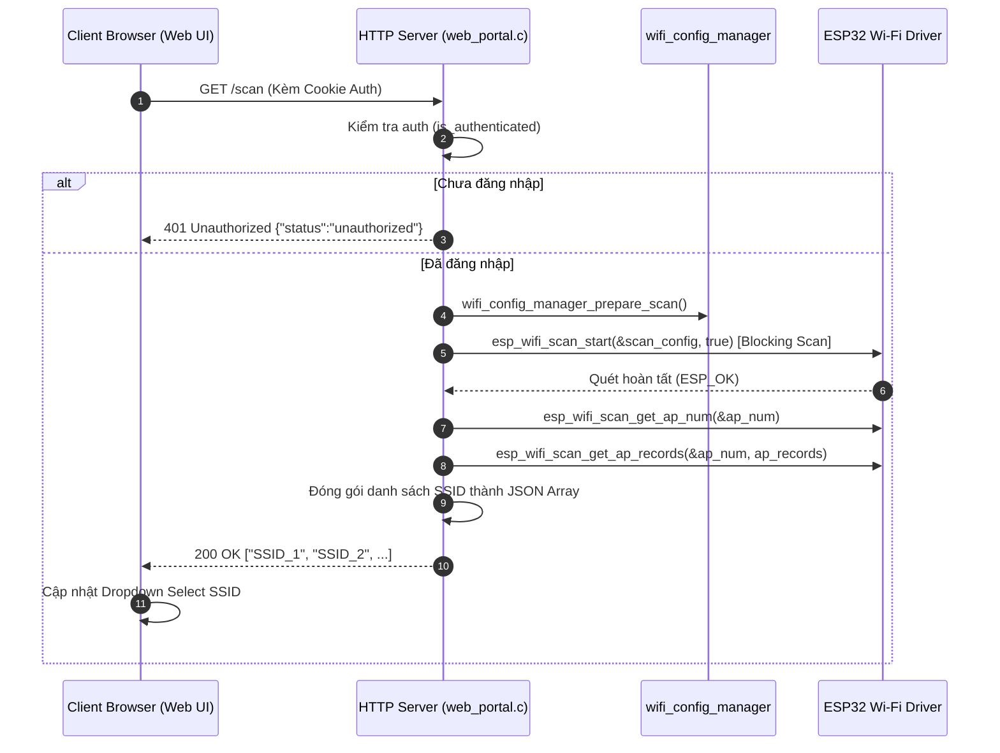

Searched for "scan"
Viewed web_portal.c:1111-1910
Viewed wifi_config_manager.c:92-891

# TÀI LIỆU PHÂN TÍCH CƠ CHẾ QUÉT WI-FI (WI-FI SCANNING) TRONG WEB PORTAL

Tài liệu này chi tiết hóa toàn bộ cơ chế quét mạng Wi-Fi trong mục **Wifi Setup** của module [web_portal.c](file:///d:/Study/STUdied/Mebi/Completed_Versions/EPS32_Weight_Rs485/main/src/web_portal.c).

---

## 1. Tổng Quan Cơ Chế

Quá trình quét Wi-Fi được kích hoạt từ giao diện Web (Frontend) bằng AJAX Request gửi tới Endpoint HTTP Server (Backend) chạy trên ESP32. 

- **Vị trí code Backend**: Handler `scan_get_handler` tại [web_portal.c:L1479-L1541](file:///d:/Study/STUdied/Mebi/Completed_Versions/EPS32_Weight_Rs485/main/src/web_portal.c#L1479-L1541).
- **Vị trí URI Registration**: Đăng ký URI `/scan` tại [web_portal.c:L2139-L2141](file:///d:/Study/STUdied/Mebi/Completed_Versions/EPS32_Weight_Rs485/main/src/web_portal.c#L2139-L2141).
- **Vị trí Frontend Javascript**: Hàm `scan()` tại [web_portal.c:L693-L701](file:///d:/Study/STUdied/Mebi/Completed_Versions/EPS32_Weight_Rs485/main/src/web_portal.c#L693-L701).



---

## 2. Các Hàm API Được Sử Dụng

| Hàm / API | Vai Trò & Chức Năng |
| :--- | :--- |
| `wifi_config_manager_prepare_scan()` | Hàm chuẩn bị quét tại [wifi_config_manager.c:L507-L510](file:///d:/Study/STUdied/Mebi/Completed_Versions/EPS32_Weight_Rs485/main/src/wifi_config_manager.c#L507-L510). Được thiết kế dạng *no-op* để giữ nguyên SoftAP hoạt động, tránh làm ngắt kết nối HTTP của Web Portal với trình duyệt. |
| `esp_wifi_scan_start(&scan_config, true)` | API của ESP-IDF kích hoạt quét Wi-Fi. Tham số `block = true` nghĩa là quét **đồng bộ (synchronous)**, hàm sẽ dừng chờ cho đến khi quét xong toàn bộ kênh mới tiếp tục. |
| `esp_wifi_scan_get_ap_num(&ap_num)` | Lấy tổng số lượng Access Point (AP) tìm thấy sau khi quá trình quét kết thúc. |
| `esp_wifi_scan_get_ap_records(&ap_num, ap_records)` | Đọc chi tiết danh sách cấu trúc AP (`wifi_ap_record_t`) từ RAM của Wi-Fi Driver vào mảng được cấp phát. |
| `cJSON_CreateArray()` / `cJSON_AddItemToArray()` | Tạo mảng đối tượng JSON để đóng gói chuỗi danh sách tên SSID. |
| `is_authenticated(req)` | Kiểm tra Cookie Session gửi từ Client với Secret được lưu trữ trong NVS nhằm bảo mật API. |

---

## 3. Quá Trình Quét Chi Tiết (Step-by-Step)

### Bước 1: Kích hoạt từ Frontend (Client Javascript)
- Khi nạp trang Web Portal lần đầu ([web_portal.c:L1383](file:///d:/Study/STUdied/Mebi/Completed_Versions/EPS32_Weight_Rs485/main/src/web_portal.c#L1383)) hoặc khi người dùng bấm nút **"Scan Networks"**, hàm `scan()` trong Javascript được gọi.
- Nút Scan chuyển sang trạng thái Loading (disabled nút, hiển thị spinner và nhãn `"Scanning..."`).
- Javascript gửi lệnh `fetch('/scan')`.

### Bước 2: Xử lý tại Backend (`scan_get_handler`)
1. **Kiểm tra Xác thực (Authentication Check)**:
   Call `is_authenticated(req)`. Nếu sai Cookie, ngắt luồng và trả về lỗi `401 Unauthorized`.
2. **Cấu hình Quét Wi-Fi (`wifi_scan_config_t`)**:
   ```c
   wifi_scan_config_t scan_config = {
     .ssid = NULL,            // Quét tất cả SSID
     .bssid = NULL,           // Quét tất cả BSSID
     .channel = 0,            // Quét trên toàn bộ các kênh (1-13)
     .show_hidden = false,    // Không hiển thị các SSID ẩn
     .scan_type = WIFI_SCAN_TYPE_ACTIVE, // Active Scan (gửi Probe Request)
     .scan_time = {
       .active = {
         .min = 0,            // Mặc định (0) để tối ưu tương thích Bluetooth Coexistence (BT/WiFi Coex)
         .max = 0
       }
     }
   };
   ```
3. **Thực thi Quét**:
   Gọi `esp_wifi_scan_start(&scan_config, true)`. Hệ thống tạm dừng luồng handler cho đến khi việc quét không tuyến tính qua các kênh kết thúc.
4. **Đọc dữ liệu AP thu được**:
   - Gọi `esp_wifi_scan_get_ap_num(&ap_num)`.
   - Dùng `calloc` để cấp phát bộ nhớ động chứa `ap_num` phần tử `wifi_ap_record_t`.
   - Gọi `esp_wifi_scan_get_ap_records(&ap_num, ap_records)` lấy danh sách AP.
5. **Lọc dữ liệu & Đóng gói JSON**:
   - Duyệt từng AP: Nếu `ap_records[i].ssid[0] == '\0'` (SSID rỗng) thì loại bỏ.
   - Thêm chuỗi SSID hợp lệ vào mảng `cJSON`.
   - Chuyển `cJSON` thành chuỗi Unformatted JSON (ví dụ: `["Home_WiFi","Office_5G","Mebi_Guest"]`).
   - Giải phóng bộ nhớ đã cấp phát (`free(ap_records)`, `cJSON_Delete(arr)`).
6. **Phản hồi Client**:
   Đặt Header `Content-Type: application/json` và gửi chuỗi JSON kết quả về client.

---

## 4. Điều Kiện Để Quét Thành Công

1. **Điều kiện xác thực (Auth)**: Người dùng phải đăng nhập hợp lệ vào Web Portal để trình duyệt gửi kèm Cookie Session `session=<secret>`.
2. **Chế độ Wi-Fi**: Trái tim Wi-Fi của ESP32 phải đang bật ở chế độ Station (`WIFI_MODE_STA`) hoặc chế độ kép AP+Station (`WIFI_MODE_APSTA`). Trong dự án này, công tắc phần cứng AP Switch ([wifi_config_manager.c:L307-L355](file:///d:/Study/STUdied/Mebi/Completed_Versions/EPS32_Weight_Rs485/main/src/wifi_config_manager.c#L307-L355)) duy trì chế độ `APSTA`, đảm bảo vừa phát Web Portal vừa quét được Wi-Fi ngoài.
3. **Đủ dung lượng bộ nhớ RAM (Heap)**: ESP32 phải còn đủ RAM tự do cho phép cấp phát mảng `ap_records` (`calloc`) và tạo cây `cJSON`.

---

## 5. Các Kịch Bản Thất Bại & Nguyên Nhân

| Kịch Bản Thất Bại | Phản Hồi / Lỗi Hệ Thống | Nguyên Nhân Chính |
| :--- | :--- | :--- |
| **Chưa đăng nhập / Phiên hết hạn** | HTTP Status: `401 Unauthorized`<br>Body: `{"status":"unauthorized"}` | Trình duyệt không gửi Cookie hoặc Cookie không khớp với Secret cấu hình. |
| **Khởi chạy Quét Thất Bại** | HTTP Status: `500 Internal Server Error`<br>Body: `scan failed`<br>Console Log: `Scan start failed: <err>` | Wi-Fi Driver bị bận (ví dụ: đang trong tiến trình thử kết nối/ngắt kết nối Wi-Fi khác) hoặc bộ điều khiển Wi-Fi bị treo. |
| **Cấp phát bộ nhớ RAM thất bại** | HTTP Status: `500 Internal Server Error`<br>Body: `no mem` hoặc `json fail` | Hệ thống bị cạn RAM (Out of Memory - OOM), `calloc` hoặc `cJSON_PrintUnformatted` trả về `NULL`. |
| **Fetch trên Frontend bị ngắt/Lỗi mạng** | Frontend Catch Error:<br>Trạng thái UI: `"Scan failed"` | Mất kết nối giữa thiết bị Client và ESP32 SoftAP trong quá trình scan. |
| **Không tìm thấy mạng Wi-Fi nào** | HTTP Status: `200 OK`<br>Body: `[]` | Không có AP nào xung quanh hoặc các AP đều bật chế độ Ẩn SSID (`show_hidden = false`). UI Frontend sẽ hiển thị `<option value=''>No Wi-Fi networks found</option>`. |

---

## 6. Các Điểm Thiết Kế Tối Ưu Nổi Bật Trong Dự Án

1. **Bluetooth Coexistence (`BT/WiFi Coex`)**:
   Khi thiết lập `.scan_time.active.min = 0` và `.max = 0`, Wi-Fi driver sẽ sử dụng khoảng thời gian quét mặc định lý tưởng, cho phép bộ điều khiển vô tuyến tự chia sẻ Time-Slot hợp lý giữa Wi-Fi Scan và Bluetooth BLE mà không gây nhiễu sóng hoặc treo BLE.
2. **Giữ nguyên kết nối SoftAP khi Quét**:
   Trong [wifi_config_manager.c:L507-L510](file:///d:/Study/STUdied/Mebi/Completed_Versions/EPS32_Weight_Rs485/main/src/wifi_config_manager.c#L507-L510), hàm `wifi_config_manager_prepare_scan()` không tắt SoftAP. Điều này đảm bảo HTTP Server không ngắt kết nối với thiết bị di động/máy tính của người dùng khi tiến hành quét Wi-Fi.
3. **Lọc nhiễu SSID rỗng**:
   Loại bỏ hoàn toàn các SSID trắng/không tên ([web_portal.c:L1524](file:///d:/Study/STUdied/Mebi/Completed_Versions/EPS32_Weight_Rs485/main/src/web_portal.c#L1524)), giúp danh sách mạng trả về danh mục cấu hình gọn gàng và chuẩn xác cho người dùng lựa chọn.

---

## 7. BÀI HỌC KINH NGHIỆM THỰC TẾ & KHẮC PHỤC LỖI TIỀM ẨN

### 1. Hiện trạng
- **Giai đoạn ban đầu**: Hệ thống triển khai chạy ngon lành, tính năng Quét Wi-Fi (Scan) hoạt động bình thường trên bàn thử nghiệm.
- **Phát sinh sự cố vận hành**: Sau thời gian dài chạy thực tế, vi điều khiển thi thoảng bị tự động khởi động lại (**Software Panic**) mà chưa tìm được nguyên nhân chính xác.
- **Tình huống sự cố hiện trường**: Khi thiết bị mang ra hiện trường bị mất Wi-Fi, kỹ thuật viên truy cập Web Config để bấm nút **Scan Networks** nhập Wi-Fi mới thì phần scan liên tục báo lỗi **HTTP 500 (Internal Server Error)** và không thể lấy danh sách mạng.
- **Khoanh vùng kỹ thuật**: Tiến hành tham khảo mã nguồn các hệ thống khác (dù chưa bị lỗi tương tự) để đánh giá các nguy cơ tiềm ẩn chưa được tối ưu, từ đó khoanh vùng chính xác và khắc phục dứt điểm hàm `scan_get_handler`.

### 2. Quá trình điều tra
- Tiến hành đối chiếu chi tiết giữa tài liệu thiết kế `.md` ban đầu và mã nguồn C thực tế (`web_portal.c` & `wifi_config_manager.c`).
- Phân tích sâu luồng tương tác bất đồng bộ trong hệ điều hành FreeRTOS giữa **Task HTTP Server** (xử lý request web) và **Default Event Loop Task** (xử lý sự kiện phần cứng Wi-Fi).

### 3. Thủ phạm (Nguyên nhân chính gây lỗi)
- 🔴 **Thủ phạm 1: Xung đột Race Condition giữa Event Loop Task và HTTP Task**
  When `esp_wifi_scan_start()` hoàn tất, Wi-Fi driver bắn sự kiện `WIFI_EVENT_SCAN_DONE`. Hàm `event_handler()` trong `wifi_config_manager.c` đăng ký nhận sự kiện này lập tức chạy trước và gọi `esp_wifi_scan_get_ap_records()`. Theo cơ chế ESP-IDF, hàm này đọc xong **sẽ tự động XÓA bộ đệm AP trong RAM Driver**. Khi `scan_get_handler()` trong `web_portal.c` chạy tiếp đến lệnh đọc AP records thì bộ đệm đã rỗng (`ap_num = 0`), làm `calloc(0, ...)` trả về `NULL` $\rightarrow$ `scan_get_handler` hiểu nhầm là cạn RAM (Out of Memory) và phản hồi **HTTP 500 "no mem"**.
- 🔴 **Thủ phạm 2: Lệnh `ESP_ERROR_CHECK()` nằm trong Web Server Handler**
  Trong `scan_get_handler` ban đầu sử dụng `ESP_ERROR_CHECK()` khi gọi các API đọc thông tin scan. Khi Wi-Fi driver trả về lỗi hoặc bộ đệm đã bị xóa, `ESP_ERROR_CHECK` gọi `abort()` cưỡng chế vi điều khiển **Software Panic / Reset** ngay lập tức thay vì chỉ trả về báo lỗi HTTP nhẹ nhàng.

### 4. Giải pháp & Đánh đổi
- **Giải pháp xử lý**:
  1. **Bỏ đọc trực tiếp driver**: Chuyển `scan_get_handler` sang sử dụng bộ đệm an toàn `wifi_config_manager_get_scan_results(ap_records, 16)` đã được `wifi_config_manager.c` thu thập và lưu giữ.
  2. **Loại bỏ Panic**: Xóa bỏ hoàn toàn `ESP_ERROR_CHECK()` trong HTTP Handler, thay bằng ghi log `ESP_LOGE` và phản hồi HTTP Error an toàn.
  3. **Tối ưu UX**: Bổ sung thuật toán sắp xếp Wi-Fi theo độ mạnh tín hiệu sóng (`RSSI` giảm dần).
  4. **Lọc nhiễu Mesh**: Lọc trùng SSID đối với các Router Mesh / Băng tần kép 2.4GHz + 5GHz.
  5. **Hiển thị chỉ số sóng**: Trả về danh sách dạng JSON Object `[{"ssid": "...", "rssi": -45}]` và hiển thị thêm cường độ sóng `(dBm)` trực tiếp trên giao diện dropdown Web Portal.
- **Đánh đổi**:
  - Cấp phát mảng tĩnh `ap_records[16]` trên Stack chiếm ~1.2 KB RAM của Task HTTP, hoàn toàn nằm trong giới hạn an toàn của Stack Web Server.

### 5. Kết luận
- **Bài học kinh nghiệm**: 
  1. Luôn chú ý cơ chế **tự động xóa bộ đệm ngầm (Auto-clear buffer)** của các API driver trong ESP-IDF SDK.
  2. **Tuyệt đối KHÔNG sử dụng `ESP_ERROR_CHECK()`** bên trong các hàm Callback / Handler của Web Server để tránh biến lỗi mạng thành sự cố rớt/sập vi điều khiển (Software Panic).